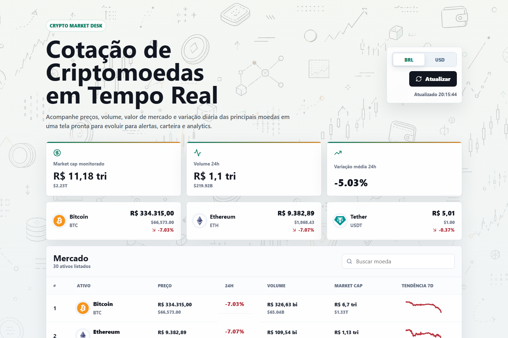

# Crypto Market Desk

Dashboard de criptomoedas em tempo real desenvolvido com React, TypeScript e Vite, consumindo dados da CoinGecko API.



## Acesse

Produção: [https://crypto-market-desk.vercel.app/](https://crypto-market-desk.vercel.app/)

## Funcionalidades

- Cotações em tempo real usando a CoinGecko Markets API
- Alternância entre valores em reais e dólares
- Valor secundário exibido em tamanho reduzido para comparação rápida
- Cards de resumo com market cap, volume 24h e variação média
- Destaque para as principais criptomoedas por valor de mercado
- Tabela com busca, preço, volume, market cap e tendência de 7 dias
- Layout responsivo com fundo visual em doodle pattern

## Stack

- React
- TypeScript
- Vite
- CSS
- lucide-react
- Vercel

## Rodando Localmente

```bash
npm install
npm run dev
```

Depois acesse:

```text
http://127.0.0.1:5173
```

## Scripts

npm run dev      # ambiente local
npm run build    # build produção
npm run preview  # visualizar build
npm run lint     # análise de código

## Deploy

Produção:
https://crypto-market-desk.vercel.app/

Build command:

```bash
npm run build
```

Output directory:

```text
dist
```

Deploy manual:

```bash
vercel --prod
```

## Próxima Etapa: AWS

🎯 Roadmap

- [x] Integração CoinGecko
- [x] Busca de ativos
- [x] Alternância BRL/USD
- [x] Deploy Vercel
- [ ] Dark Mode
- [ ] Favoritos
- [ ] Gráfico histórico
- [ ] Integração AWS Lambda
- [ ] Alertas de preço
